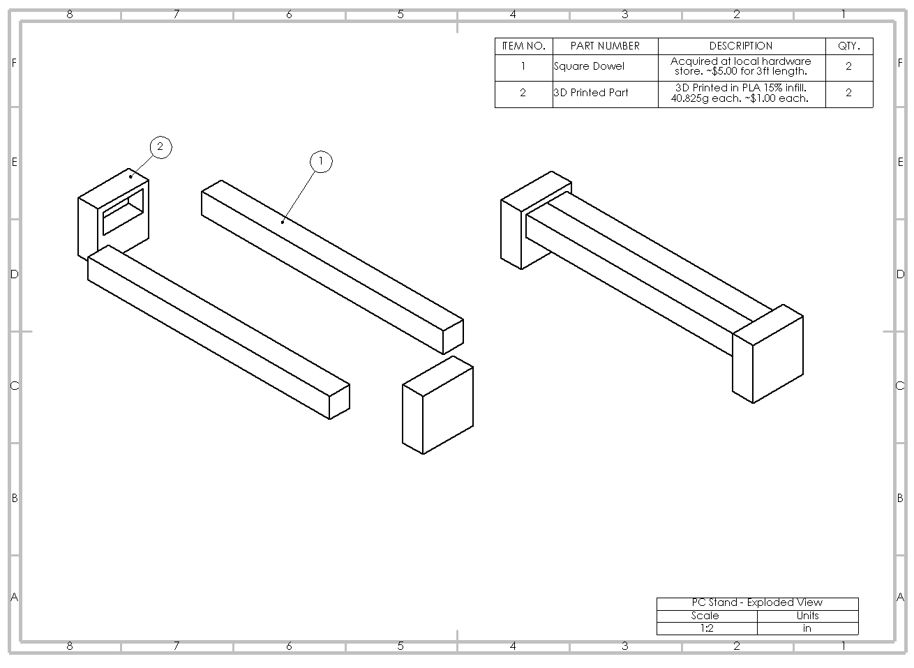
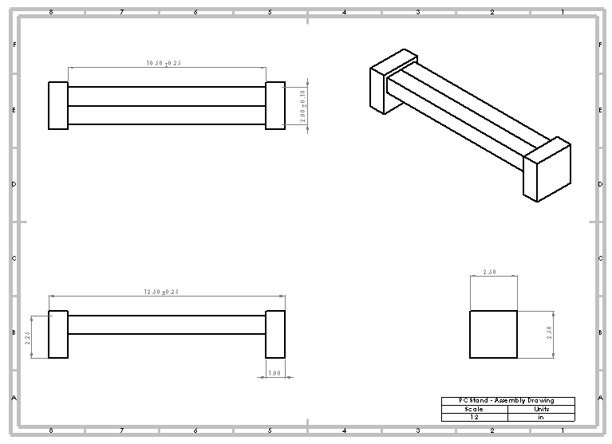
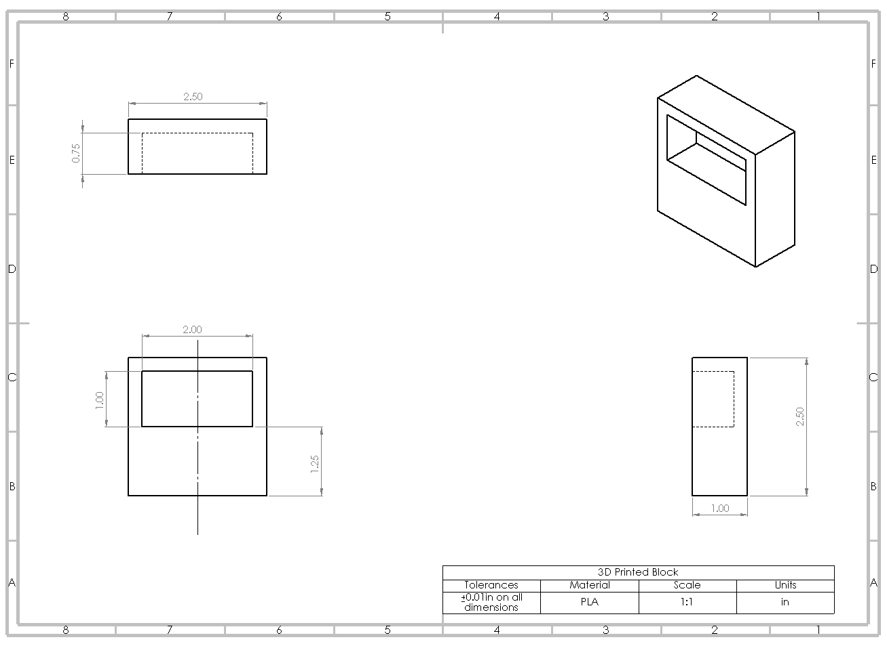
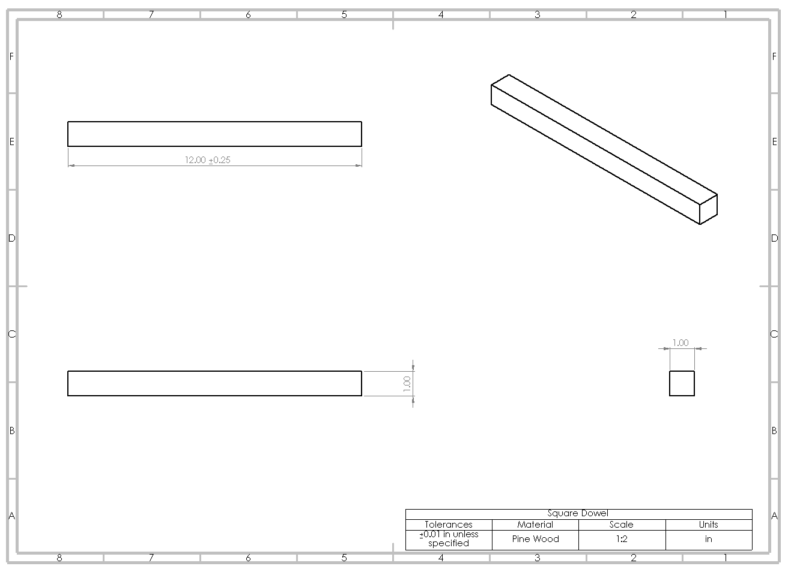

# PC Stand Project

  

---

## The purpose of this project is to improve the performance and extend the lifespan of my PC. More specifically to prevent the PC's Power Supply from suffocating. 

---
## Summary
---

This is a simple and low-cost PC stand designed using SolidWokrs and manufactured using 3D-printed end blocks and wooden dowels. This design prioritizes ease of 
assembly, low material cost, and clean aesthetics.

---

## Detailed Explanation

---

The Power Supply is located at the bottom of the case. It has a fan which takes in air from the bottom of the case and circulates it through the Power Supply and
into the case in order to regulate the internal temperature of the PC and its components.

In wooden or tiled floor the height from the case's design is usually enough. On carpet floors however, the Power Supply's fan is blocked and its airflow is restricted. 
The purpose of this project is to restore airflow to the Power Supply fan, therefore providing proper cooling to the PC and extending its lifespan. 

---

# Technical Drawing Preview

---

[📄 **View Drawing Package (PDF)**](./drawings/PC%20Stand%20Drawing%20Package.pdf)

  

  

  

  

---

# PC Stand in Use

---

  

